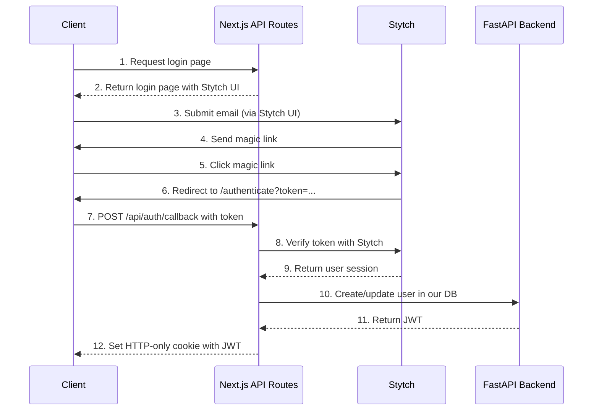

This document outlines the authentication flow for the Tagline application, which uses Stytch for passwordless authentication with email magic links.

## Architecture Overview

The authentication system follows a three-tier architecture:

1. **Client**: Browser-based React application using Stytch UI components
2. **Frontend (Next.js)**: Handles API routing, session management, and proxies requests
3. **Backend (FastAPI)**: Manages user data, roles, and JWT issuance
4. **Stytch Service**: Handles passwordless authentication via email magic links

### Communication Flow



## Implementation Details

### 1. Frontend Setup

#### Dependencies
```bash
npm install @stytch/nextjs @stytch/vanilla-js
```

#### Environment Variables
```env
# .env.local
NEXT_PUBLIC_STYTCH_PUBLIC_TOKEN=your_public_token
NEXT_PUBLIC_API_BASE_URL=http://localhost:8000
NEXTAUTH_URL=http://localhost:3000
NEXTAUTH_SECRET=your_nextauth_secret
```

#### Stytch Provider
```jsx
// pages/_app.jsx
import { StytchProvider } from '@stytch/nextjs';
import { createStytchUIClient } from '@stytch/nextjs/ui';

const stytchClient = createStytchUIClient(
  process.env.NEXT_PUBLIC_STYTCH_PUBLIC_TOKEN
);

export default function App({ Component, pageProps }) {
  return (
    <StytchProvider stytch={stytchClient}>
      <Component {...pageProps} />
    </StytchProvider>
  );
}
```

### 2. Authentication Flow Components

#### Login Page
```jsx
// pages/login.jsx
import { StytchLogin } from '@stytch/nextjs';
import { Products } from '@stytch/vanilla-js';

export default function Login() {
  const config = {
    products: [Products.emailMagicLinks],
    emailMagicLinksOptions: {
      loginRedirectURL: `${process.env.NEXTAUTH_URL}/api/auth/callback`,
      loginExpirationMinutes: 30,
      signupRedirectURL: `${process.env.NEXTAUTH_URL}/api/auth/callback`,
      signupExpirationMinutes: 30,
    },
  };

  return <StytchLogin config={config} />;
}
```

#### API Route for Callback
```javascript
// pages/api/auth/callback.js
export default async function handler(req, res) {
  if (req.method !== 'POST') {
    return res.status(405).json({ message: 'Method not allowed' });
  }

  try {
    const { token } = req.body;
    
    // 1. Verify token with Stytch
    const stytchResponse = await verifyStytchToken(token);
    
    // 2. Check email against whitelist
    const isEligible = await checkEmailEligibility(stytchResponse.email);
    if (!isEligible) {
      return res.status(403).json({ message: 'Email not authorized' });
    }
    
    // 3. Create/update user in our backend
    const userResponse = await createOrUpdateUser({
      email: stytchResponse.email,
      stytchUserId: stytchResponse.user_id
    });
    
    // 4. Set JWT in HTTP-only cookie
    setTokenCookie(res, userResponse.jwt);
    
    // 5. Redirect to dashboard
    res.redirect(302, '/dashboard');
    
  } catch (error) {
    console.error('Authentication error:', error);
    res.status(500).json({ message: 'Authentication failed' });
  }
}
```

### 3. Protected Routes

```jsx
// components/ProtectedRoute.jsx
import { useRouter } from 'next/router';
import { useEffect } from 'react';
import { useStytchUser } from '@stytch/nextjs';

export default function ProtectedRoute({ children }) {
  const { user, isInitialized } = useStytchUser();
  const router = useRouter();

  useEffect(() => {
    if (isInitialized && !user) {
      router.push('/login');
    }
  }, [user, isInitialized, router]);

  if (!isInitialized || !user) {
    return <div>Loading...</div>;
  }

  return children;
}
```

## Security Considerations

1. **HTTP-only Cookies**: Store JWT in HTTP-only cookies to prevent XSS attacks
2. **CSRF Protection**: Implement CSRF tokens for state-changing operations
3. **Secure Headers**: Use security headers via Next.js middleware
4. **Rate Limiting**: Implement rate limiting on authentication endpoints
5. **Session Management**: Set appropriate session timeouts and refresh tokens

## Authentication Flow

The authentication system is designed to provide secure access to JLLA members through a multi-step verification and authentication process.

### 1. Email Verification
- User enters their email address on the login page
- Frontend checks if the email exists in the pre-approved whitelist (~1500 JLLA members)
- If approved, the user proceeds to authentication
- If not approved, access is denied

### 2. Stytch Authentication
- Frontend initiates Stytch's magic link flow
- Stytch sends a magic link to the user's email
- User clicks the magic link in their email
- Stytch authenticates the user and returns tokens to the frontend

### 3. Backend Authentication
- Frontend sends the Stytch token to `/v1/auth/authenticate`
- Backend verifies the token with Stytch's API
- If valid, the backend:
  - Creates a new user if they don't exist
  - Updates existing user if needed
  - Assigns default roles (e.g., 'member')

### 4. JWT Issuance
- Backend creates a JWT containing:
  - User ID
  - Email
  - Assigned roles
  - Session information
- JWT is returned to the frontend

### 5. Session Management
- Frontend stores the JWT (typically in HTTP-only cookies or secure storage)
- JWT is included in the Authorization header for subsequent requests
- Backend validates the JWT for protected routes

## User Roles

Tagline supports multiple roles that can be assigned to users:
- `member`: Basic access level for all JLLA members
- `admin`: Administrative privileges
- `active`: Currently active JLLA members
- `sustainer`: Sustaining members

Users can have multiple roles simultaneously.

## Security Considerations
- All authentication requests use HTTPS
- JWT tokens are signed and have expiration times
- Sensitive operations require appropriate role permissions
- Session tokens are validated on each request

## Implementation Details

### Frontend Components
- Login form with email input
- Stytch integration for magic link flow
- Token storage and request interception
- Protected route components

### Backend Endpoints
- `POST /v1/auth/verify-email`: Verify email against whitelist
- `POST /v1/auth/authenticate`: Validate Stytch token and issue JWT (returns `AuthResponse`)
- `GET /v1/auth/me`: Get current user information
- `POST /v1/auth/roles/assign`: Assign a role to a user (admin only)
- `POST /v1/auth/roles/bulk-assign`: Assign multiple roles to a user (admin only)
- `DELETE /v1/auth/roles/{role_name}`: Remove a role from a user (admin only)
- `GET /v1/auth/roles`: List all available roles (admin only)
- `POST /v1/auth/eligible-emails`: Add an email to the whitelist (admin only)
- `POST /v1/auth/eligible-emails/bulk`: Add multiple emails to the whitelist (admin only)

### Environment Variables
- `STYTCH_PROJECT_ID`: Stytch project identifier
- `STYTCH_SECRET`: Stytch API secret
- `STYTCH_ENV`: Stytch environment (test/live)
- `JWT_SECRET`: Secret for signing JWTs
- `JWT_EXPIRATION`: JWT expiration time

## Future Considerations
- Implement refresh token rotation
- Add multi-factor authentication
- Session management dashboard for users
- Audit logging for security events
