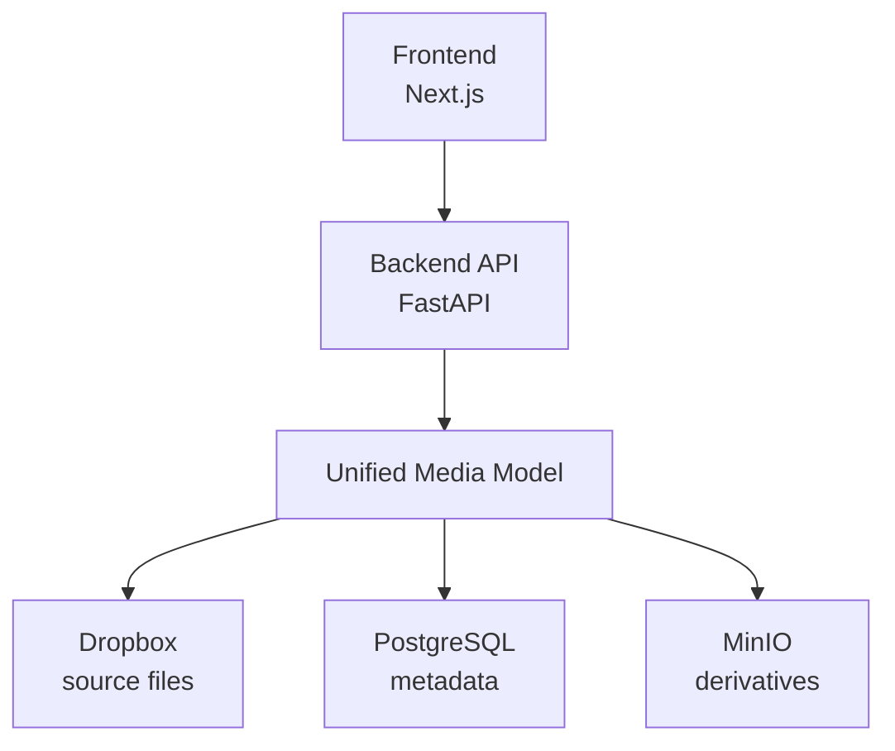

# Tagline Specification v2.0
*Date: June 3, 2025*

## Overview

Tagline is a media management system for the Junior League of Los Angeles (JLLA) that provides enhanced browsing and organization of their Dropbox photo collection. The system implements **lazy ingest** architecture that mirrors Dropbox's folder structure while providing instant search, thumbnails, and metadata management.

## Core Philosophy

**The backend synthesizes storage provider + database + object storage into a single, unified view of the media space.** All queries should be answered instantly from this unified model, not by calling external APIs during user interactions.

## Architecture



### Components

- **Frontend**: Next.js with App Router, TypeScript, Tailwind CSS
- **Backend**: FastAPI with lazy ingest job system  
- **Database**: PostgreSQL for metadata and object tracking
- **Object Storage**: MinIO for thumbnails and derivatives
- **Source Storage**: Dropbox (read-only, authoritative for originals)
- **Job Queue**: Redis for background processing

## Data Model

### MediaObjectRecord

The core entity uses **object keys** (file paths) as the primary identifier:

```json
{
    "object_key": "2024-2025/Touch a Truck/IMG_1234.jpg",
    "ingestion_status": "completed",
    "metadata": {
        "description": "Members setting up for the event"
    },
    "file_size": 2048576,
    "file_mimetype": "image/jpeg",
    "file_last_modified": "2024-10-15T09:30:00Z",
    "created_at": "2025-06-03T10:00:00Z",
    "updated_at": "2025-06-03T10:00:00Z",
    "has_thumbnail": true,
    "has_proxy": false
}
```

**Key Design Decisions:**
- Object keys are unique identifiers (no separate UUIDs)
- JLLA's stable file organization makes object keys reliable
- Eliminates UUID↔path translation complexity
- Natural folder hierarchy from path structure

## Lazy Ingest System

### Core Concept
Users browse folders normally. When they request a folder that contains unprocessed media, the system:

1. **Fast Path**: Returns already-ingested media instantly from database
2. **Slow Path**: Queues background discovery/ingest for new items
3. **Progressive Enhancement**: Updates UI as new items are processed

### MediaObjectRepository

The repository provides two key methods:

```python
def get_objects_with_prefix(self, prefix: str) -> List[MediaObjectRecord]:
    """Get media objects directly in this folder (no subfolders)"""
    
def get_subfolders_with_prefix(self, prefix: str) -> List[str]:
    """Get immediate subfolder names under this prefix"""
```

These enable instant folder navigation without Dropbox API calls.

## API Design

### Core Endpoints (v1)

**Storage & Browsing:**
- `GET /v1/storage/browse` - Browse folders and files, triggers lazy ingest
- `GET /v1/storage/folders/{path}` - Get folder structure only  
- `GET /v1/storage/media/by-folder/{path}` - Get media in specific folder

**Media Objects:**
- `GET /v1/media` - List media objects with optional prefix filter
- `GET /v1/media/{object_key}` - Get single media object
- `PATCH /v1/media/{object_key}` - Update metadata
- `GET /v1/media/{object_key}/data` - Stream original file data
- `GET /v1/media/{object_key}/thumbnail` - Stream thumbnail from MinIO
- `GET /v1/media/{object_key}/proxy` - Stream proxy/preview from MinIO
- `GET /v1/media/{object_key}/adjacent` - Get prev/next media for navigation

**Search:**
- `GET /v1/media/search?q={query}` - Full-text search across metadata

**Background Processing:**
- `POST /v1/tasks/ingest` - Trigger ingest orchestrator
- `GET /v1/tasks/ingest/status` - Get ingest progress
- `GET /v1/events/ingest` - SSE stream for real-time updates

**Authentication:**
- `POST /v1/auth/verify-email` - Check email eligibility
- `POST /v1/auth/authenticate` - Authenticate with Stytch token
- `GET /v1/auth/me` - Get current user info

## Storage Strategy

### Three-Tier Storage
1. **Dropbox**: Source of truth for original files (read-only)
2. **PostgreSQL**: Metadata, object tracking, search indices  
3. **MinIO**: Generated derivatives (thumbnails, proxies)

### Derivatives Storage
- Thumbnails: 256×256 JPEG, stored in MinIO
    - Organized with object key prefixes: `thumbnails/{object_key}.jpg`
    - Can be regenerated if lost (not precious data)
- Proxies: 1024×1024 JPEG, also in MinIO
    - Organized with object key prefixes: `proxies/{object_key}.jpg`
    - Can be regenerated if lost (not precious data)

## Frontend Navigation

### Smooth Folder Browsing
- Uses Next.js client-side routing (no page reloads)
- Maintains SSE connections for live updates
- Progressive loading: show cached results immediately, update with new discoveries
- Breadcrumb navigation matching Dropbox structure

### Performance Targets
- Folder navigation: <100ms (database queries only)
- Thumbnail loading: <500ms  
- Search results: <200ms

## Background Processing

### Job Management
- Redis Queue for background tasks
- Duplicate detection prevents redundant work
- Progress tracking for long-running operations
